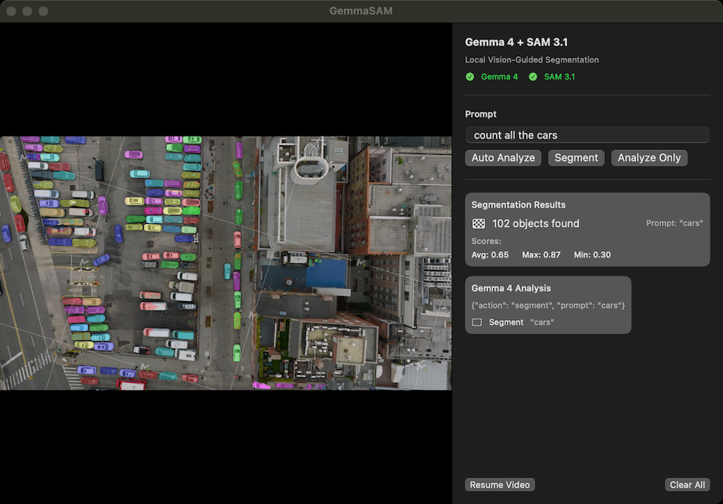

# Gemma SAM MLX

Local vision-guided segmentation on Apple Silicon — Gemma 4 decides what to look for, SAM 3.1 segments it. No cloud, no API.

Reproduces [Maziyar Panahi's demo](https://x.com/MaziyarPanahi/status/2042592050940449260) with a native macOS app.

<a href="https://workshop.ai?utm_source=built_with_workshop&utm_medium=readme_badge&utm_content=ai-capabilities-explorer">
  <picture>
    <source media="(prefers-color-scheme: dark)" srcset="https://img.shields.io/badge/Built%20with-Workshop-EA5E2A?style=flat-square&labelColor=0E1116">
    
  </picture>
</a>



## Architecture

```
┌──────────────────┐                 ┌──────────────────┐
│   SwiftUI App    │◄───────────────►│ FastAPI Backend  │
│  (macOS native)  │ localhost:8199  │   (Python/MLX)   │
└──────────────────┘                 └─────────┬────────┘
                                               │
                                     ┌─────────┴─────────┐
                                     │                   │
                              ┌─────────────┐   ┌────────────────┐
                              │   Gemma 4   │   │    SAM 3.1     │
                              │ (reasoning) │   │ (segmentation) │
                              └─────────────┘   └────────────────┘
```

**Models** (auto-downloaded on first run):
- Gemma 4: `mlx-community/gemma-4-26b-a4b-it-4bit` (15.6 GB, MoE 26B/4B active)
- SAM 3.1: `mlx-community/sam3.1-bf16` (3.49 GB, ~873M params)

## Quick Start

```bash
# 1. Install Python deps
uv venv && source .venv/bin/activate
uv sync

# 2. Start backend + launch macOS app
./start.sh app

# Or just the backend (for curl/API use)
./start.sh backend
```

## API Endpoints

| Endpoint | Method | Description |
|---|---|---|
| `/api/status` | GET | Model loading status |
| `/api/segment` | POST | Segment image with text prompt |
| `/api/analyze` | POST | Gemma 4 image analysis |
| `/api/analyze-and-segment` | POST | Auto-analyze then segment |

```bash
# Example: segment all vehicles
curl -F "image=@photo.jpg" -F "prompt=all vehicles" http://localhost:8199/api/segment
```

## macOS App

Drag an image or video into the app, type a prompt (e.g. "all vehicles"), click **Segment**. Use **Auto Analyze** to let Gemma 4 decide what to segment.

Build from Xcode:
```bash
cd GemmaSAMApp && xcodegen generate && open GemmaSAMApp.xcodeproj
```

## Requirements

- macOS 14+ (Apple Silicon)
- Python 3.11+
- Xcode 16+ (for SwiftUI app)
- ~19 GB RAM for model loading